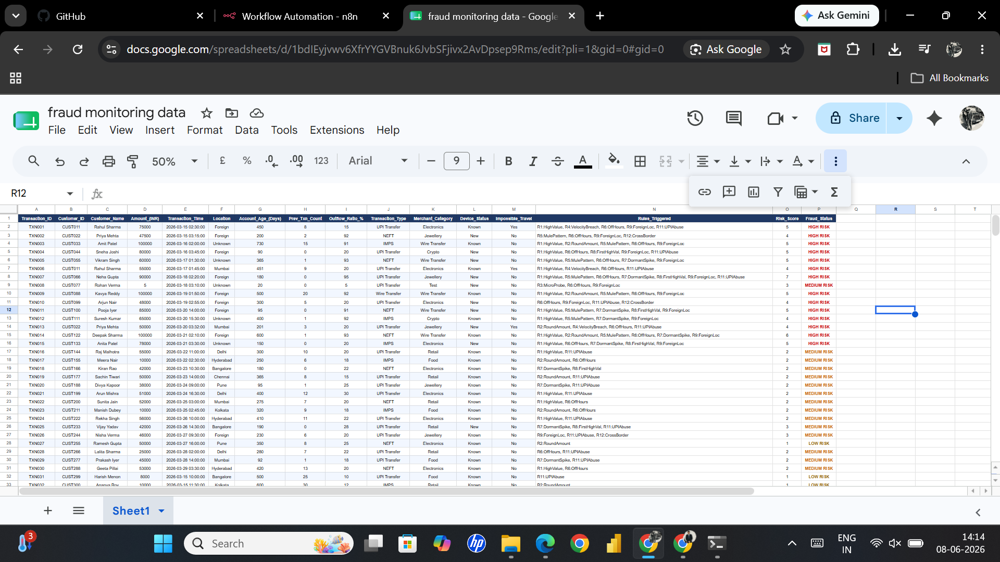
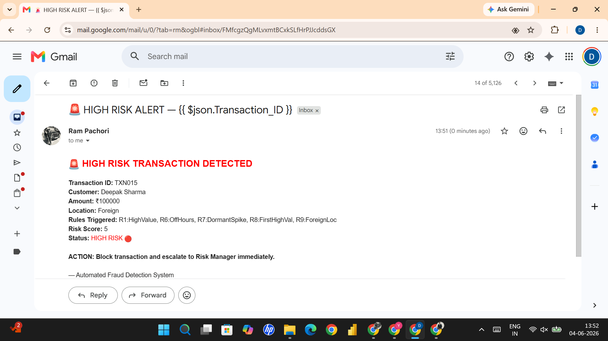
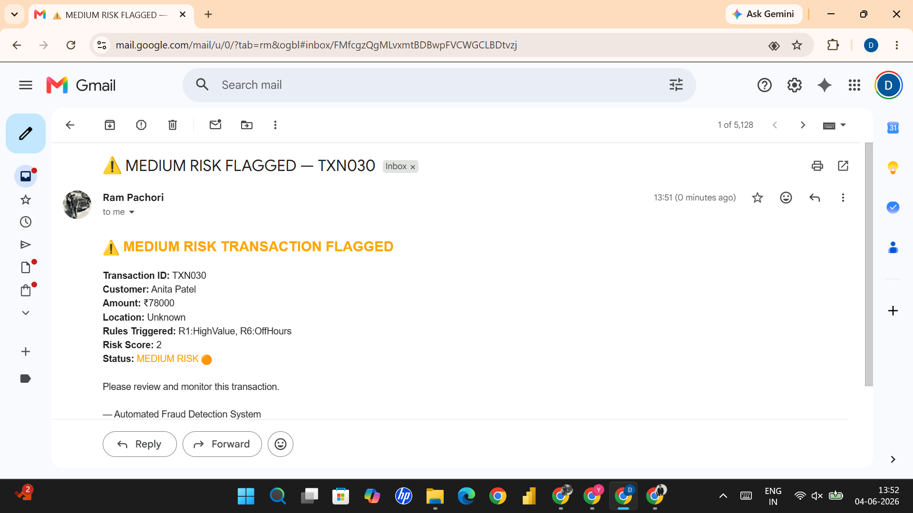

# 📸 Project Screenshots

## Fraud Monitoring Dataset

Shows:
- Transaction data
- Risk score
- Fraud status
- Triggered rules

---

## 🔴 High Risk Alert

Automated alert for high-risk transactions.

---

## 🟠 Medium Risk Alert

Automated review notification.

---

## 🔄 n8n Workflow

Workflow orchestration and fraud evaluation process.
